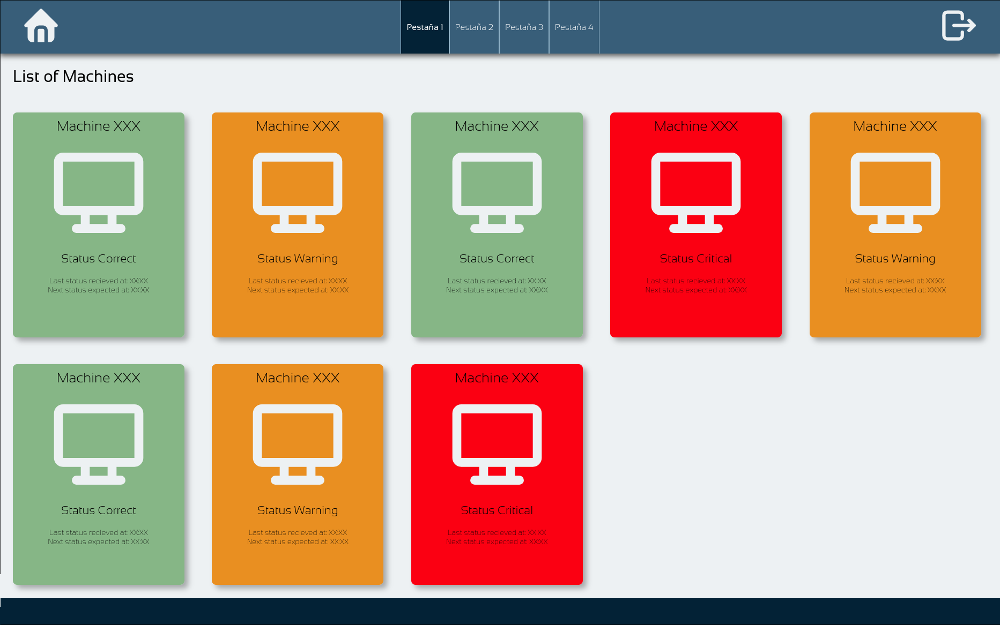

# Usb Commander
> *Realizado por [Jorge Rojas Díaz](https://github.com/Raikuno) para el GFGS DAW en I.E.S. Kursaal Curso 25/26*

La finalidad de este proyecto es la de ofrecer un sistema de supervisión y un cierto grado de control para aquellos equipos que, 
ya sea por contener información sensible o por cualquier otro motivo, no se desee que se permita una conexión USB con dispositivos de almacenamiento externo.

El principio fundamental sobre el que trabaja esta aplicación es que cualquiera que realmente busque saltarse una medida de seguridad, terminará lograndolo, por ello, USB Commander se centra
en ofrecer una forma rápida, sencilla y efectiva para conocer el estado de las unidades de memoria USB conectadas a las máquinas contraladas por la aplicación, o si se encuentra una unidad
USB conectada en primer lugar.

## Estructura
USB Commander se divide en dos aplicaciones:
- **Cliente**: Como su nombre indica, esta aplicación se instala en aquellos ordenadores a los que se quiera iniciar el seguimiento y se encargará de enviar la información a la aplicación de servidor
- **Servidor**: Esta aplicación será la que deba ejecutarse en el equipo que hara de servidor. El servidor se encargará de recibir la información de estado de las aplicaciones de cliente, además de mostrarla en una interfaz web.

## Flujo de Operación
1. La aplicación de cliente se ejecuta de fondo en el equipo
2. La aplicación de cliente envia el informe de estado actual del equipo cliente
3. La aplicación de servidor recibe la información y la guarda en la base de datos
4. La interfaz de la aplicación servidor muestra la situación de los equipos visualmente, permitiendo ver rápidamente cuáles requieren de una revisión.

## Interfaz
La interfaz web de la aplicación de servidor representará la información almacenada en la base de datos de tal forma que se pueda saber a simple vista si algún euipo requiere de una revisión por una actividad extraña.

Las tarjetas mostradas en la imagen representan los equipos registrados en la base de datos, mientras que mediante un sistema de colores, se puede identificar el estado de los quipos
- **Verde**: El equipo no requiere revisión
- **Amarillo**: Se ha detectado una actividad extraña. Se requiere revisión
- **Rojo**: Se ha detectado una actividad extraña que requiere de revisión urgente.

## Arquitectura
La aplicación de cliente esta escrita enteramente en Java, mientras que la aplicación de servidor utiliza Spring y Spring Boot.

La aplicación de cliente se puede encontrar en la ruta `programas/cliente`, mientras que la aplicación de servidor se puede encontrar en la ruta `programas/servidor`

[Instalación](./install_instructions.md)
