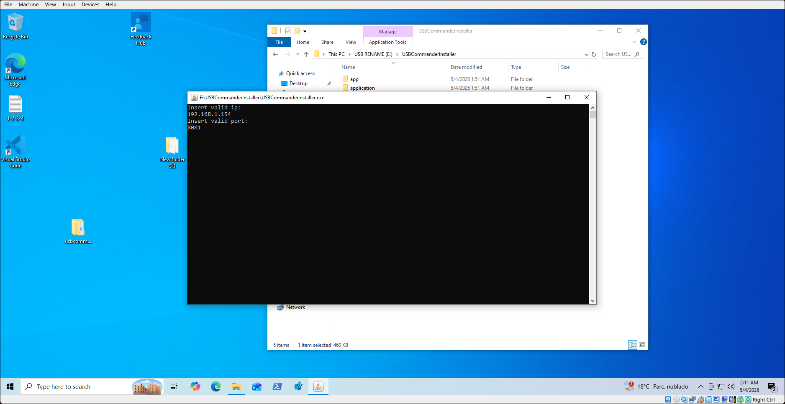
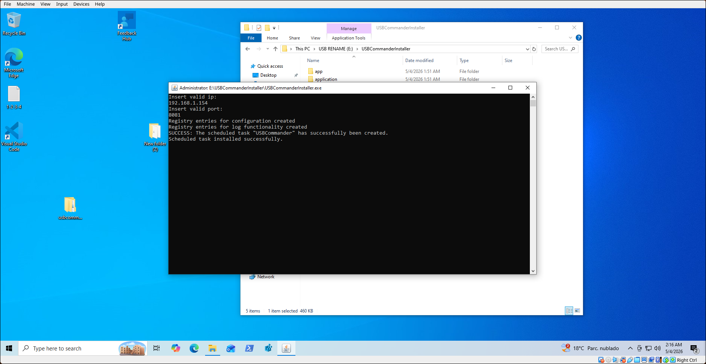
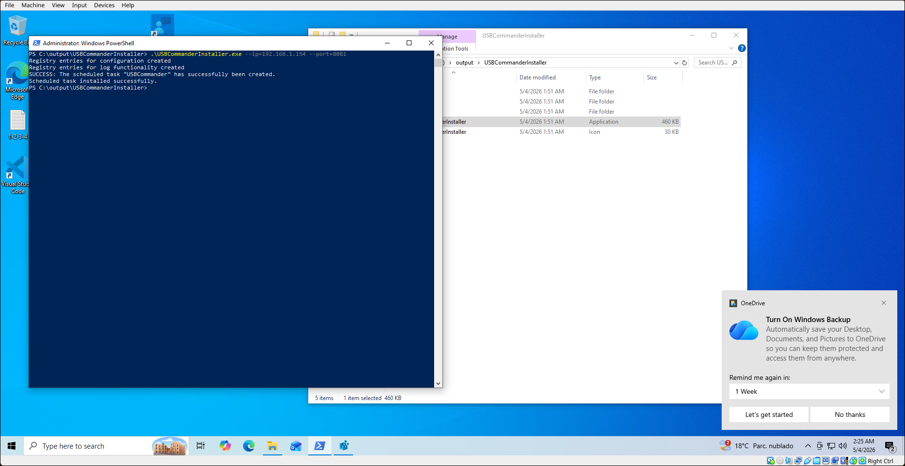
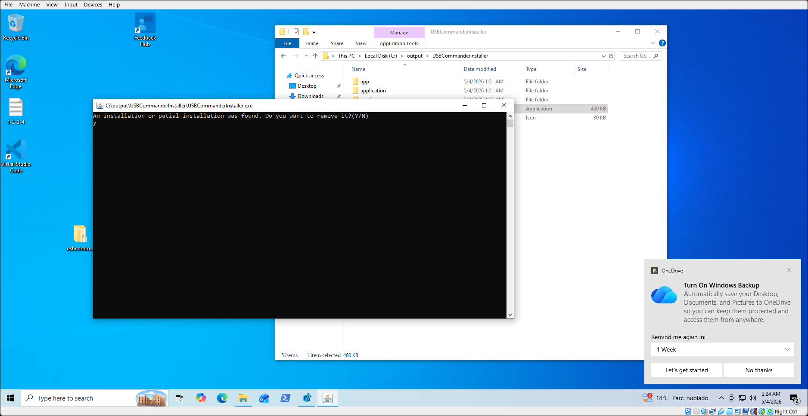
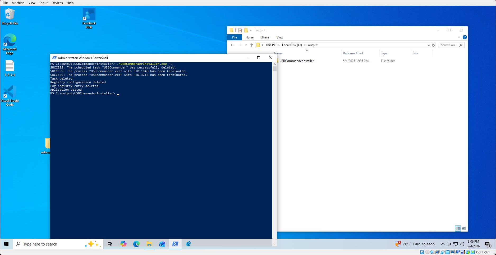

# Requerimientos
La aplicación de cliente necesita ser instalada en los equipos de los que se desea llevar el seguimiento. Para esta tarea se ha construido una aplicación dedidaca a preparar el entorno necesario para que la aplicación de cliente puede ejecutarse de manera correcta. Gracias a jpackage, la aplicación ha sido empaquetada de tal forma que no requiere de una instalación de java para poder funcionar, sin embargo, debido a limitaciones de tiempo, no ha sido posible configurar la aplicación para poder conectarse desde redes externas, por lo que para asegurar el correcto funcionamiento de la aplicación, se necesita que el cliente se encuentre en la misma red que el servidor.<br>
Con respecto a los requisitos del sistema, la aplicación de cliente requerira que el equipo cuente con las siguientes especificaciones:
- Windows 10/11
- CPU x64 bits
- 300 MB de ram dedicados a la aplicación
- Dirección ip estática configurada


# Instalación
Como ya se ha mencionado, para poder ejecutar la aplicación correctamente, se debe hacer uso del instalador proporcionado. El uso de este es extremadamente sencillo. La única información a tener en cuenta es la ip y el puerto del socket del servidor. A continuación se muestran los pasos a seguir para la instalación: 
1. Se debe abrir la aplicación UsbCommanderInstaller con permisos de administrador. Tras ello se mostrará una ventana que preguntará por la ip del servidor:


2. Introducimos la ip, tras lo que nos preguntará por el puerto que también deberemos introducir:


3. Tras esto la aplicación comenzará a instalarse, creando las entradas en el registro de windows para almacenar su configuración, creando el canal para emitir los logs en el visor de eventos de windows, moviendo la carpeta con los archivos de la aplicación a la carpeta de programas instalados de windows y preparando una tarea del administrador de tareas que permitirá iniciar la aplicación con permisos de administrador al momento de iniciar el sistema operativo.


4. Al finalizar, el instalador se cerrará. Una vez reiniciado el ordenador, la aplicación comenzará a ejecutarse en segundo plano, sin embargo, se recomienda llevar a cabo la instalación y preparación de la aplicación del servidor antes de iniciar la aplicación de cliente.

De manera alternativa, se puede saltar esta instalación haciendo uso de los parámetros ```--ip``` y ```--port``` al ejecutar el instalador por linea de comando:


Para desinstalar la aplicación, bastará con abrir de nuevo el instalador. Este detectará automáticamente si hay algun resto de instalación previa de USBCommander (entradas de registro, archivos de la aplicación, etc) y ofrecerá la posibilidad de desinstalar la aplicación. También se puede desinstalar haciendo uso del parámetro -u al momento de ejecutar el instalador por linea de comando:



Al momento de desinstalar la aplicación, se borrarán todas las entradas de registro relacionadas con la aplicación, asi como los archivos. Además, se configurará para habilitar la posibilidad de conectar memorias usb nuevamente al equipo.