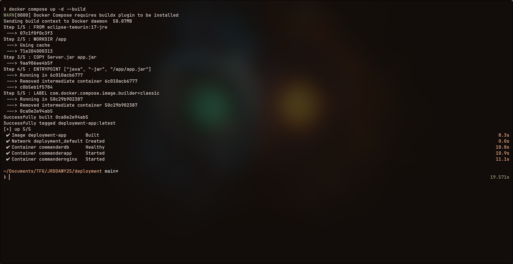
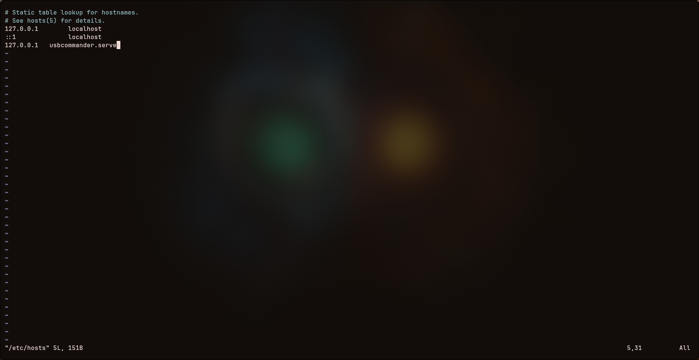

[volver](./README.md)
# Requerimientos
La aplicación de servidor se encarga de ofrecer una interfaz con la que interactuar con las máquinas y la información almacenada en la base de datos, de la cuál, la aplicacióñ de servidor también se encargará de administrar.
Para poder ejecutar la aplicación de servidor, hará falta un entorno capáz de ejecutar aplicaciones de java 17, pues la aplicación se ofrece como formato .jar. Además, será necesario construir previamente una base de datos de mariadb con la estructura y los valores descritos en el script de creación, pues la aplicación necesita poder acceder a la base de datos para iniciar correctamente.
Sumado a lo anterior, se necesitarán las siguientes especificaciones técnicas, suponiendo que tanto la base de datos como la aplicación vayan a ejecutarse en la misma máquina:
- 1.5 GB de ram
- Espacio libre recomendado mayor a 10GB
- CPU de 2 cores como mínimo
- Se recomienda linux como sistema operativo

# Instalación
La aplicación puede ejecutar desde el archivo .jar directamente siempre y cuando se haya instalado java 17 y se haya iniciado la base de datos de mariadb, sin embargo, es necesario configurar ciertas variables de entorno para permitir a la aplicación ejecutar correctamente: 

- COOKIE_SECURE: Deberá ser configurada con un valor de 'true' o 'false', en función de si se va a desplegar la applicación en un entorno de producción o no, pues habilitar la opción forzará la necesidad de un certificado ssl enn la página para permitir el almacenaje y lecturas de cookies de inicio de sesión

- DATABASE_URL: Dirección en la que se aloja la base de datos de maria_db.

- MARIADB_USER: usuario de la base de datos

- MARIADB_PASSWORD: contraseña del usuario de la base de datos
- SOCKET_PORT: Puerto a dedicar en la conexión por socket dedicada a las aplicaciones de cliente
- JWT_SECRET: Clave a utilizar para la generación de los jwt que permitirán el acceso de los usuarios registrados.
- REFRESH_TOKEN_LIFE: El tiempo de vida en segundos del token que se utilizará para generar los access token de los usuarios.

- ACCESS_TOKEN_LIFE: El tiempo de vida en segundos del token que se usará para acceder a una cuenta.

- LOG_ROUTE: Ruta en la que se generarán registros de errores ocurridos en las conexiones con las aplicaciones de clientes.

Para facilitar la tarea a la hora de ejecutar la aplicación, se proporciona una carpeta con la aplicación, una imagen de docker, un archivo de configuración de nginx, el script de la base de datos, un archivo .env con variables de ejemplo y un archivo docker_compose, de tal forma que bastará con tener docker o docker-compose instalado, y usar el comando `docker compose up -d` o `docker-compose up -d` en función de la versión descargada, para poder ejecutar un entorno con la aplicación de servidor. El archivo de docker compose hace uso de variables de entorno adicionales:

- DATABASE_ROOT_PASSWORD: Contraseña de usuario root de mariadb
- USBCOMMANDER_DATABASE: Nombre de la base de datos a usar
- MARIADB_USER: Usuario de la base de datos de mariadb. Será usada en el contenedor de maridb y de la aplicación de servidor de usbcommander
- MARIADB_PASSWORD: Contraseña de la base de datos de mariadb. Será usada en el contenedor de maridb y de la aplicación de servidor de usbcommander

- DATABASE_URL: Dirección de la base de datos
- SERVER_PORT: Puerto de la aplicación de servidor
- SOCKET_PORT: Puerto a dedicar en la conexión por socket dedicada a las aplicaciones de cliente
- JWT_SECRET: Clave a utilizar para la generación de los jwt que permitirán el acceso de los usuarios registrados.
- REFRESH_TOKEN_LIFE: El tiempo de vida en segundos del token que se utilizará para generar los access token de los usuarios.
- ACCESS_TOKEN_LIFE: El tiempo de vida en segundos del token que se usará para acceder a una cuenta.
- LOG_ROUTE: Ruta en la que se generarán registros de errores ocurridos en las conexiones con las aplicaciones de clientes.
- COOKIE_SECURE: True habilita las cookies seguras, false las deshabilita
- SERVER_NAME: Nombre del servidor de nginx

Este último campo es extremadamente importante, pues en función del valor definido, será necesario configurar y acceder a esa dirección para acceder a la página de la aplicación de Servidor de UsbCommander. En el caso de que no se quiera realizar la configuración, se puede hacer usso del nombre _, lo que permitirá acceder desde cualquier dirección que apunte a localhost. Sin embargo, si se desea configurar la dirección, será necesario editar el archivo ```/etc/hosts``` en el caso de linux, o ```C:\Windows\System32\drivers\etc\hosts``` en el caso de windows, y añadir la siguiente linea:
```
127.0.0.1   usbcommander.server
```
Reemplazando "usbcommander.server" por el nombre empleado.

