[volver](./README.md)
# Uso
Una vez instalada la aplicación de servidor, se mostrará una página de creación de usuario al acceder a la página principal:
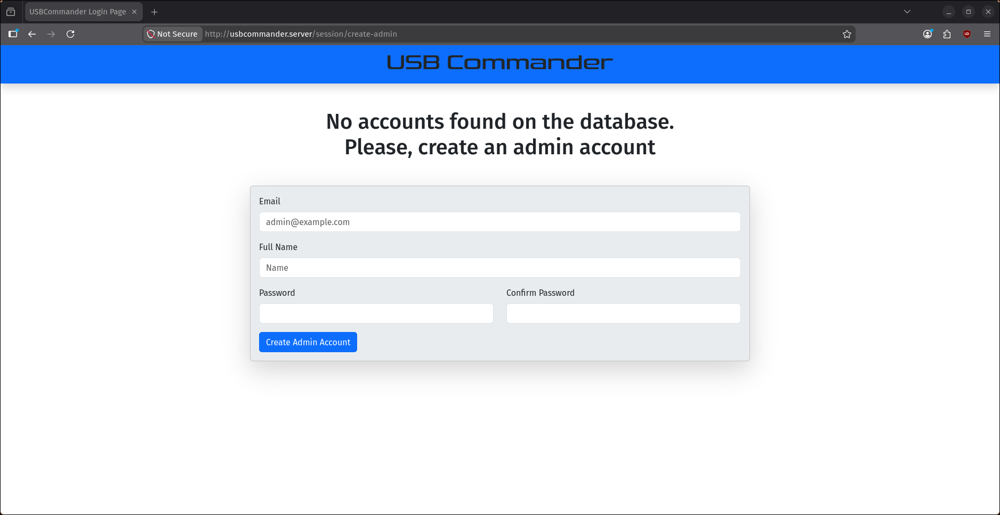
Esta página solo se mostrará si la aplicación detecta que no existen cuentas almacenadas en la base de datos, y solo será accesible bajo estas circunstancias. Una vez introducidos los datos se dirigirá a la página de inicio de sesión.
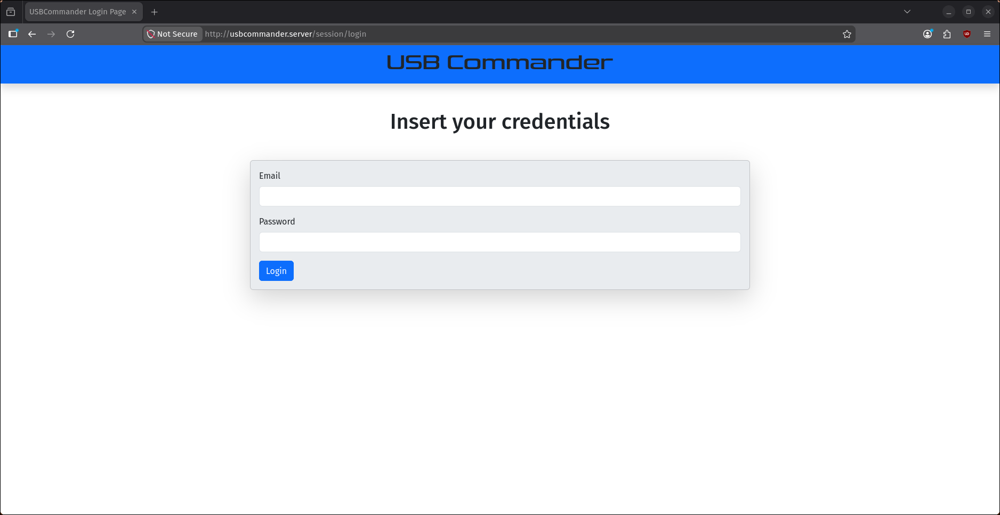
  
Una vez se haya iniciado sesión, se mostrará la página princiipal de la aplicación, esta mostrará una serie de elementos que variará en función de los permisos del usuario que haya iniciado sesión.
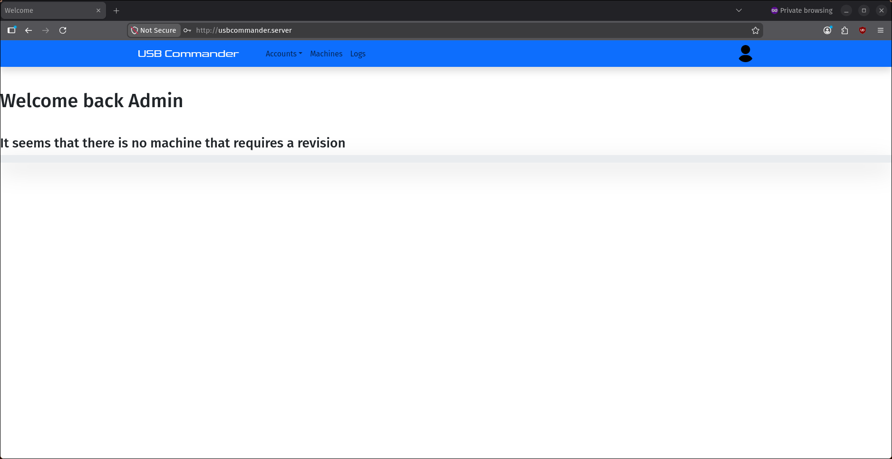

## Página principal
Desde esta página tendremos acceso al navbar en el que se encuentran enlaces a todas las páginas de la aplicación, siendo estas las páginas relacionadas a la administración de cuentas, la página de administración de máquinas, la página de administración de registros y las opciones de cuenta de usuario.
Además del navbar, como se puede ver en la anteerior imagen, se muestra un elemento que mostrará aquellas máquinas que requieran de una revisión, es decir, que esten relaciionadas a un registro de un tipo que se denomine que necesite revisión.
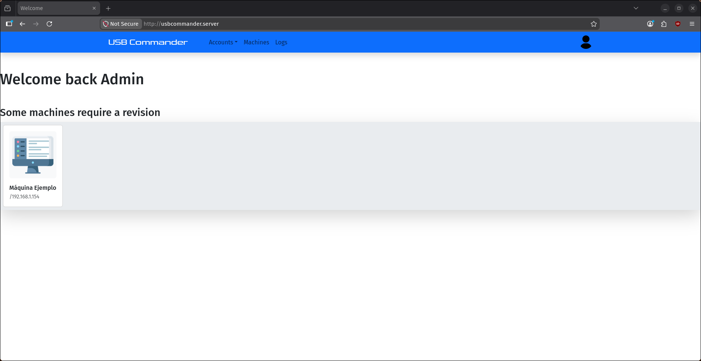
La tarjeta que se muestra será únicamente informativa, mostrando el nombre y la ip de la máquina que rerquiere revisión, sin embargo, para acceder a la información del registro o de la máquina, será necesario navegar a la página pertinente.

## Páginas de administración de usuario
Al hacer clic en la opción de cuentas del menú de navegación se mostrarán tres opciones: Usuarios, Roles y Permisos
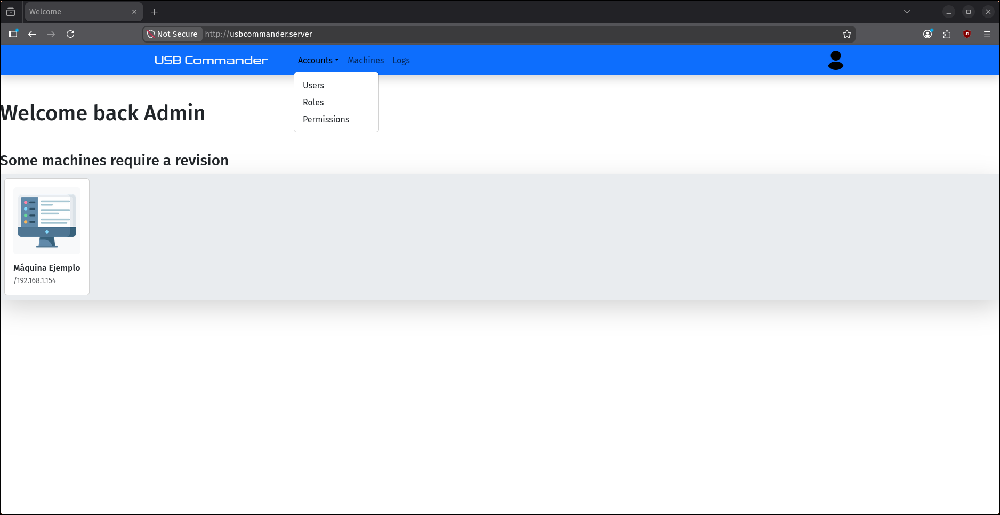
La primera opción redirige a la página de administración de usuarios, en ella, además de poder acceder a las otras dos páginas, se ofrecen las opciones de creación, edición, desactivación y activación de cuentas de usuario
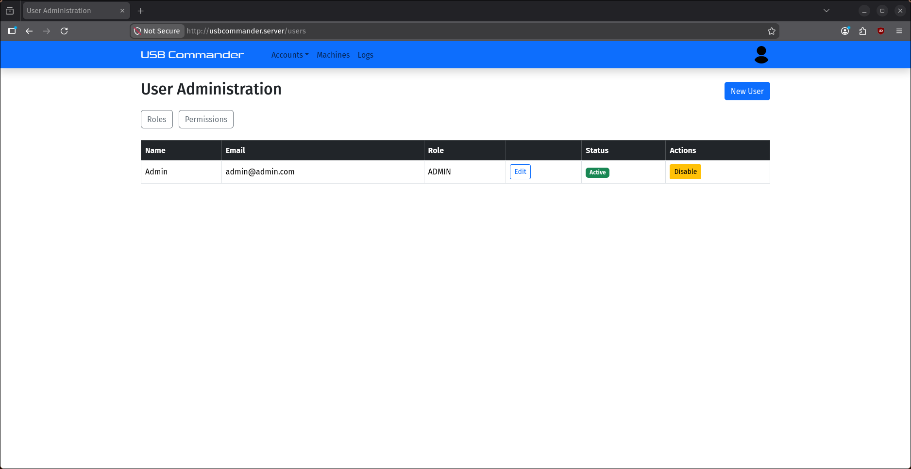
Si se desactiva una cuenta, esta no podrá ser usada, por lo que se debe procurar no desactivar la cuenta de usuario administrador para evitar problemas.
Al clicar en el botón de nuevo usuario, se redirigirá a un formulario en el que se deberán insertar las credenciales del usuario a crear: 
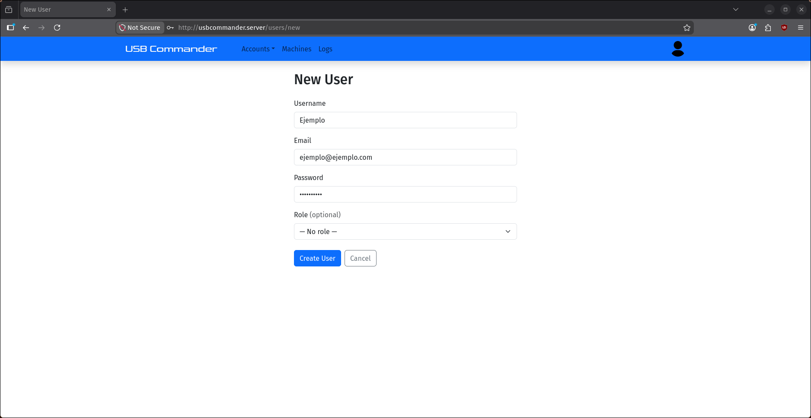

Un detalle importante es que un usuario puede ser creado sin roles, pero al no tener asignado ningún rol, solo podrá acceder a la página de inicio. 
A la hora de editar a un usuario, por cuestiones de seguridad, no se permitirá alterar la contraseña de este
  
Al acceder a la páginna de roles, se nos mostrarán todos los roles creados, por defecto, la aplicacion unicamente crea el rol de ADMIN, con todos los permisos.
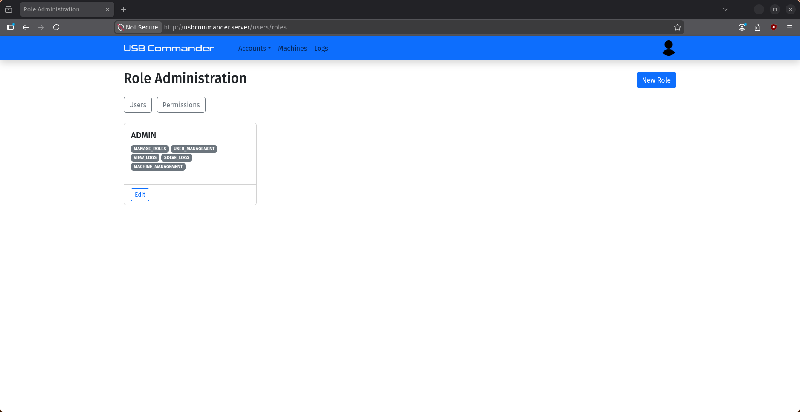
Desde esta página, se puede además, crear y editar roles. A la hora de crear o editar un rol, se dirigirá a un formulario que mostrará los permisos almacenados en la base de datos y un campo para nombrar el rol.
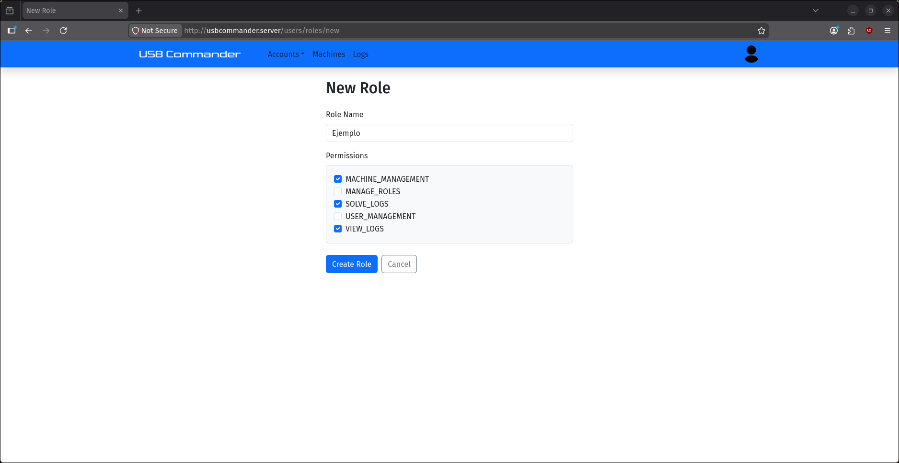
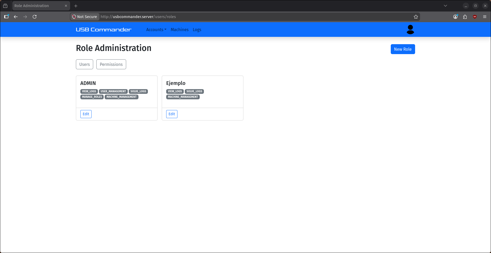
Por supuesto, este nuevo rol podrá ser asignado a un usuario, proporcionandole los permisos asignados:
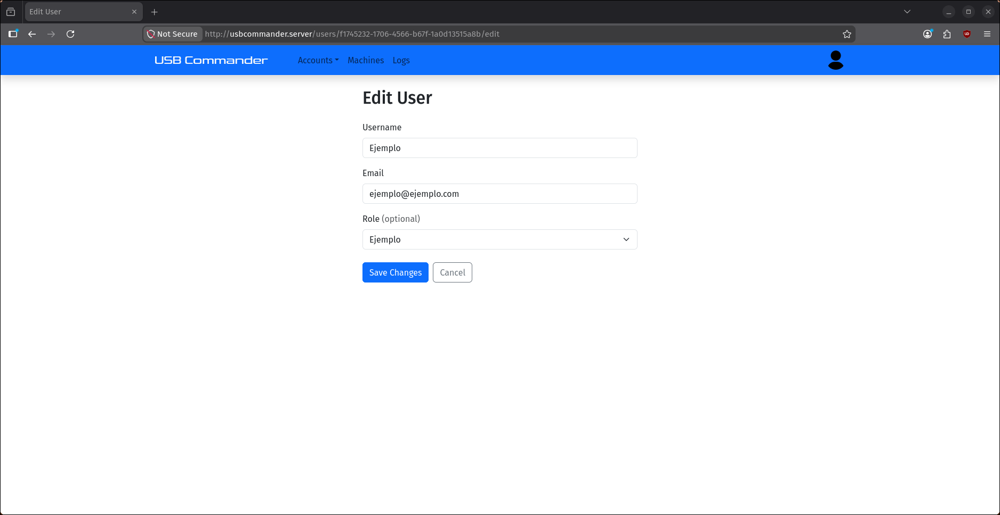
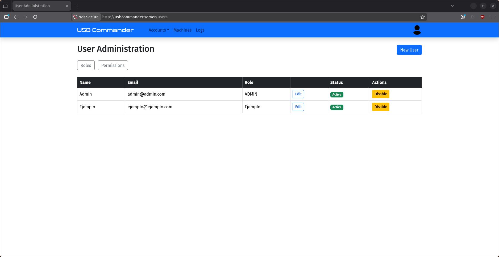
  
La última página relacionada a la administración de cuentas de usuario es la página de permisos, en ella se muestran todos los permisos ofrecidos por la aplicación.
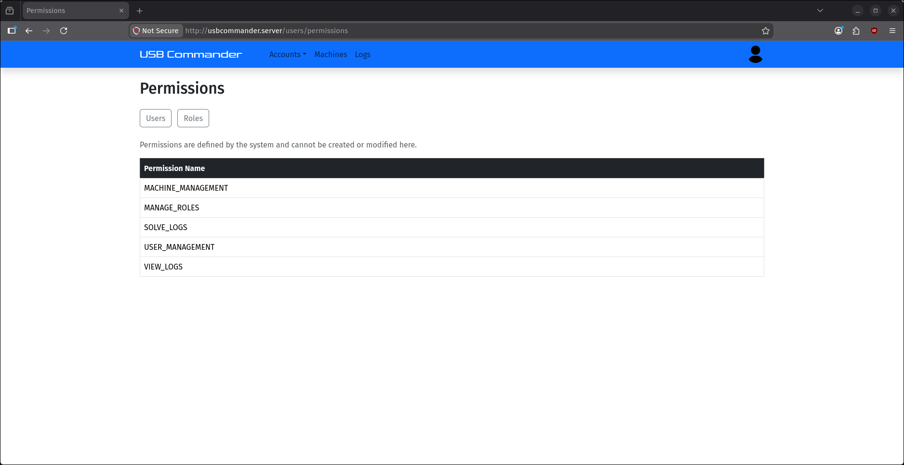
Estos permisos son creados al iniciar la base de datos con el script pertinente, y debido a la forma en la que se estructura la aplicación, no es posible añadir o alterar el funcionamiento de estos sin modificar el código.
A continuación se muestra una descripción de las acciones que permiten realizar los permisos:
<table>
    <tr>
        <th>MACHINE_MANAGEMENT</th>
        <td>Permite acceder a las páginas y realizar peticiones a los endpoints dedicados a mostrar y modificar las máquinas</td>
    </tr>
        <tr>
        <th>MANAGE_ROLES</th>
        <td>Permite acceder a las páginas y realizar peticiones a los endpoints que permiten crear, ver y modificar roles</td>
    </tr>
        <tr>
        <th>SOLVE_LOGS</th>
        <td>Permite acceso a las páginas y realizar peticiones a los endpoints dedicados a marcar registros como resueltos</td>
    </tr>
        <tr>
        <th>USER_MANAGEMENT</th>
        <td>Permite acceder a las páginas y realizar peticiones a los endpoints dedicados a crear y modificar usuarios</td>
    </tr>
        <tr>
        <th>VIEW_LOGS</th>
        <td>Permite acceder a las páginas y realizar peticiones a los endpoints dedicados a mostrar los registros y sus detalles</td>
    </tr>
</table>

## Páginas relacionadas a las máquinas
Al acceder a la página de maquinas del menú de navegación, se nos mostrará un grid con todas las máquinas almacenadas en la base de datos. Además, en función de su estado, la tarjeta de la máquina cambiara, apareciendo blanca si no requiere de revisión, amarilla si requiere de revisión y roja si requiere de revisión urgente. Ademáß, se marcará con una etiqueta si está conectada o no.
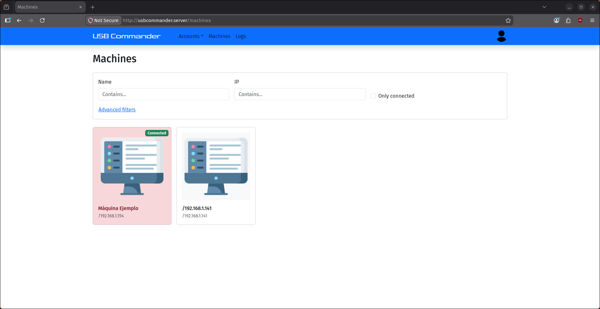
Además de las máquinas, también se puede encontrar un formulario con opciones de filtrado en el caso de que sea necesario encontrar una máquina concreta. El formulario permite:
- Buscar por nombre
- Buscar por ip
- Mostrar máquinas deshabilitadas
- Mostrar solo las máquinas conectadas
- Mostrar solo las máquinas que requieran revisión

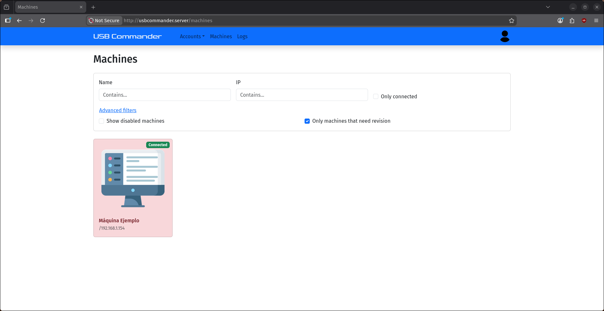
  

Al clicar en una de las tarjetas, se mostrará la información de la máquina. En esta página se puede ver la frecuencia de los registros regulares, la fecha de registro, la descripción, el nombre, la ip y los registros de la máquina, divididos en dos pestañas. Además, también se muestra un formulario que permite alterar la configuración de la máquina si esta esta conectada.
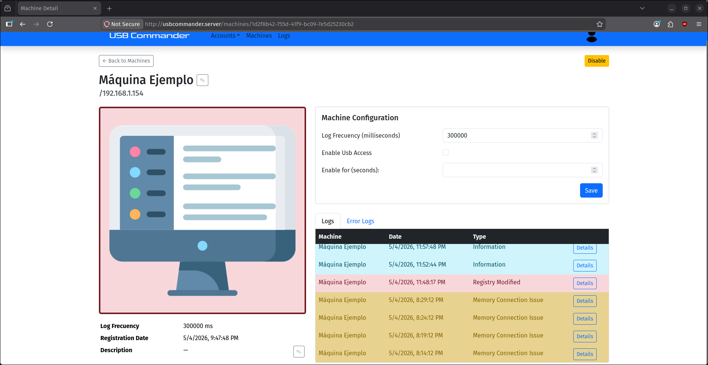
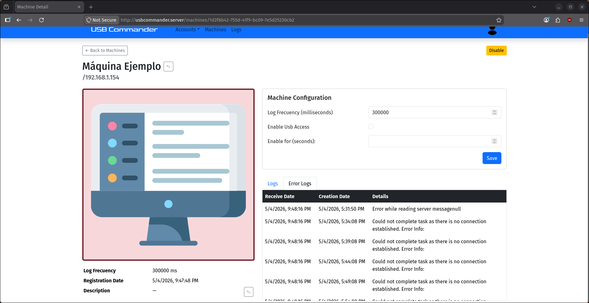

Al lado del campo de descripción y nombre se muestran botones de editar, que permiten entrar en un modo edición para alterar estos campos.
Si se desean ver los detalles de uno de los registros de la máquina, esto se puede hacer clicando el botón peertinente en el registro que se desea ver. Al hacerlo se mostrará una página con la información del registro y, si fuese posible, un botón con la opción de marcar el registro como revisado.
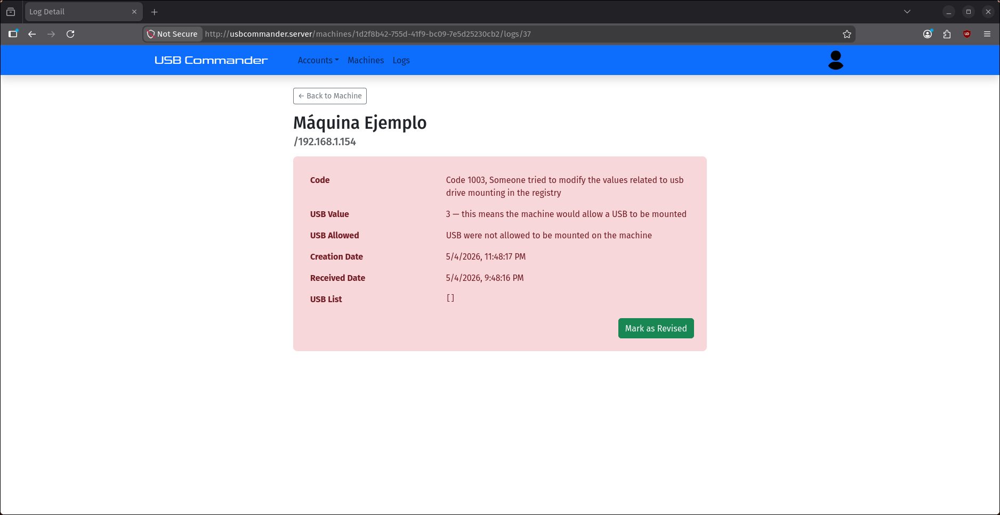
Tras marcar un registro como revisado, el color de este pasará a ser verde, y el color del icono de la máquina pasara se ajustará al del registro de mayor gravedad sin revisar.
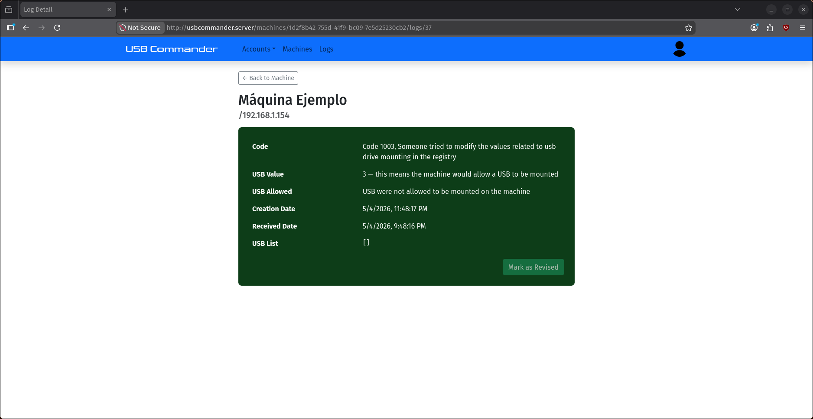
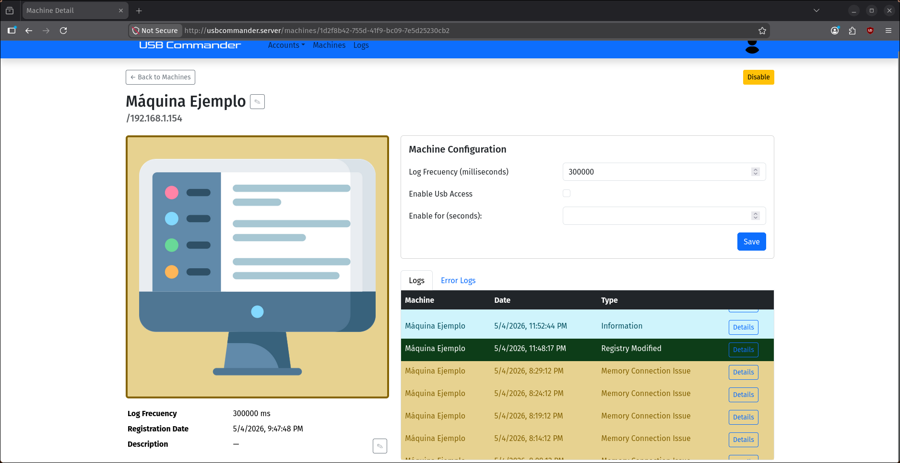

## Páginas relacionadas a los registros
La tercera opción mostrada en la barra de navegación, permite acceder a una lista de los registros que requieren de revisión de todas las máquinas almacenadas en la base de datos.
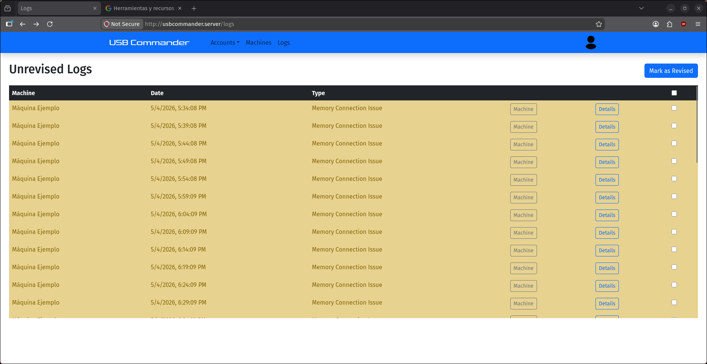

Desde esta página se pueden ver los detalles de un registro, la máquina de la que proviene el registro o, se pueden validar un conjunto de registros al mismo tiempo marcándolos individualmente o marcando la opción de marcarlos todos, y clicando el botón de "marcar como revisado".
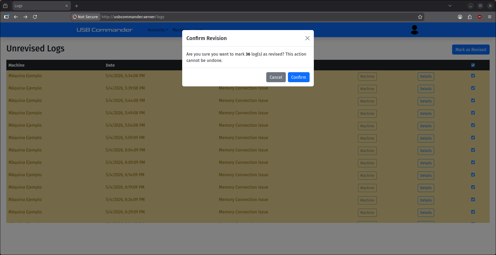
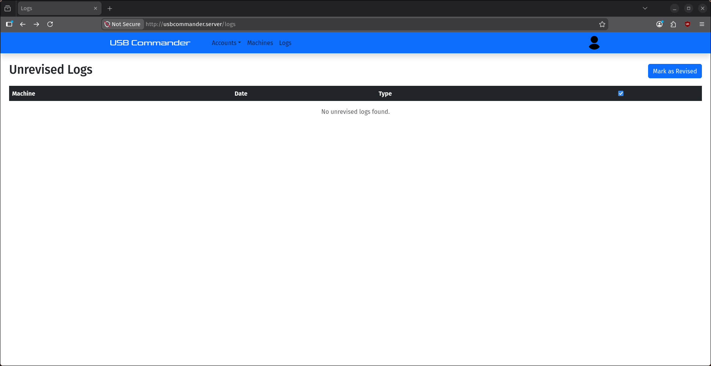

## Páginas relacionadas con los ajustes de la cuenta
Las páginas relacionadas a las acciones de la cuenta de usuario pueden ser accedidas desde el icono de usuario de la barra de navegación.
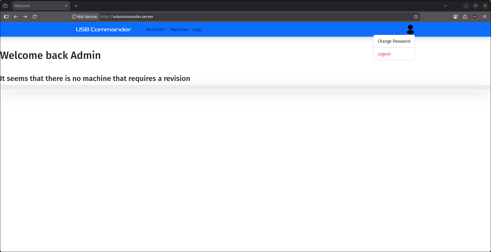
La primera de esttas opciones redirigirá a un formularrio en el que se podrá cambiar la contraseña tras introducir la actual
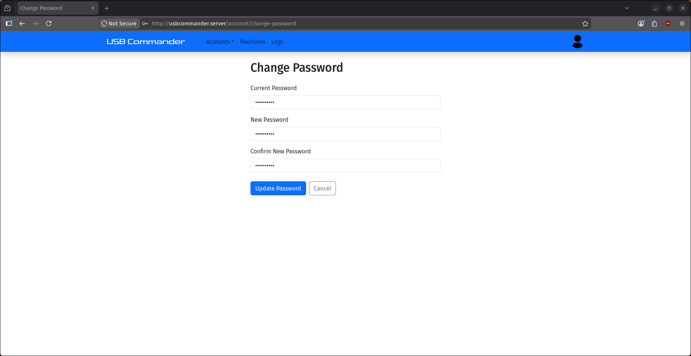
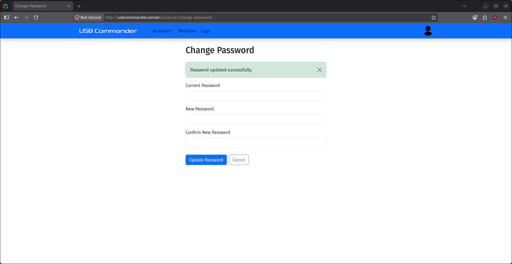
Al cambiar la contraseña todas las sesiones asignadas al usuario (refresh tokens) serán marcadas como invalidas, por lo que al momento de caducar el access token del usuario, se le pedirá que inicie sesión de nuevo.

La segunda opción, sirve para cerrar sesión, "eliminando" las cookies con los tokens del usuario.

## Conexión con máquinas cliente
Al momento de iniciar el servidor, al mismo tiempo, se iniciará un hilo adicional encargado de configurar un server socket que aceptará cualquier máquina que trate de conectarse al servidor, registrandola en caso de que no lo este ya, siendo la única formma de evitar una conexión con una máquina cliente, el bloqueo de esta emmdiante la propia interfaz. Esto es, por supuesto, una vulnerabilidad severa en la aplicación, sin embargo, debido a diferentes problemas surgidos durante el desarrollo de la aplicación y falta de tiempo, no se ha podido configurar la seguridad necesaria en esta conexión. En un futuro se pretende configurar un sistemma de autenticación mediante certificados mTLS, lo que tambien permitiría conexiones de máquinas externas a la red.